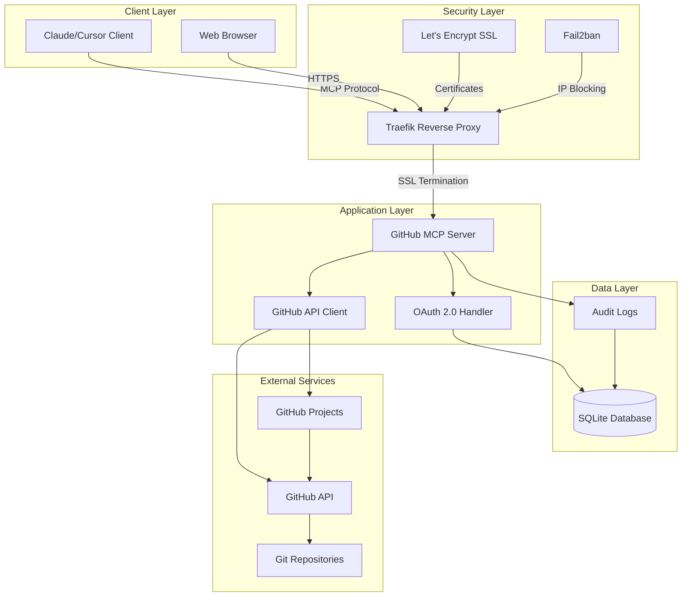
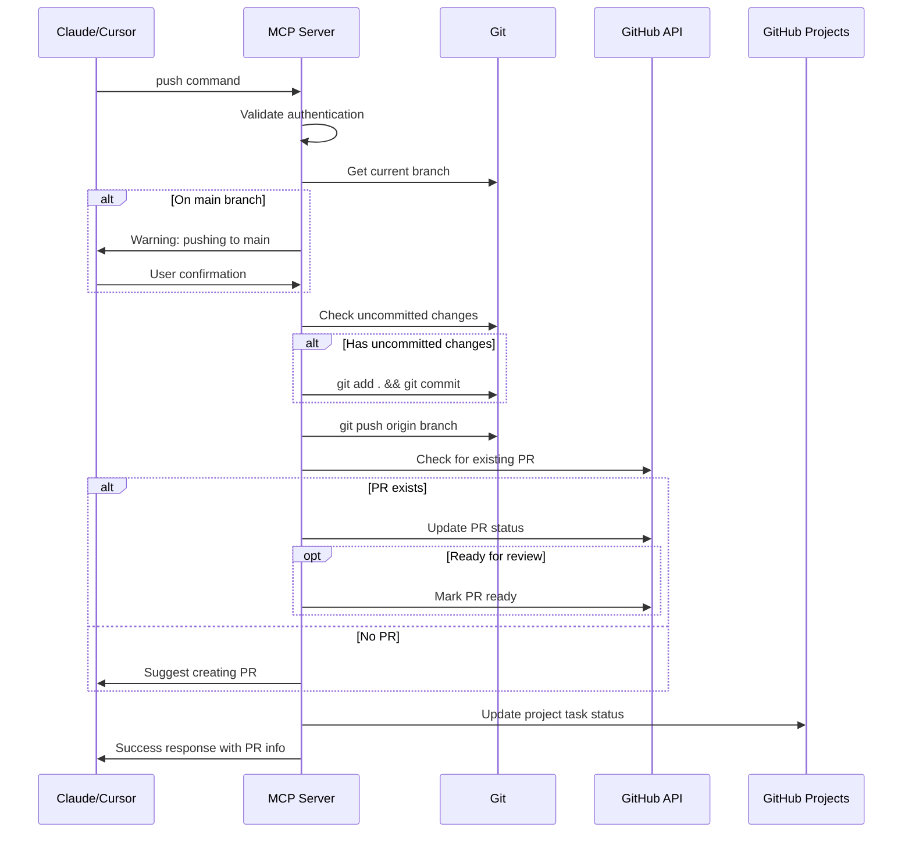
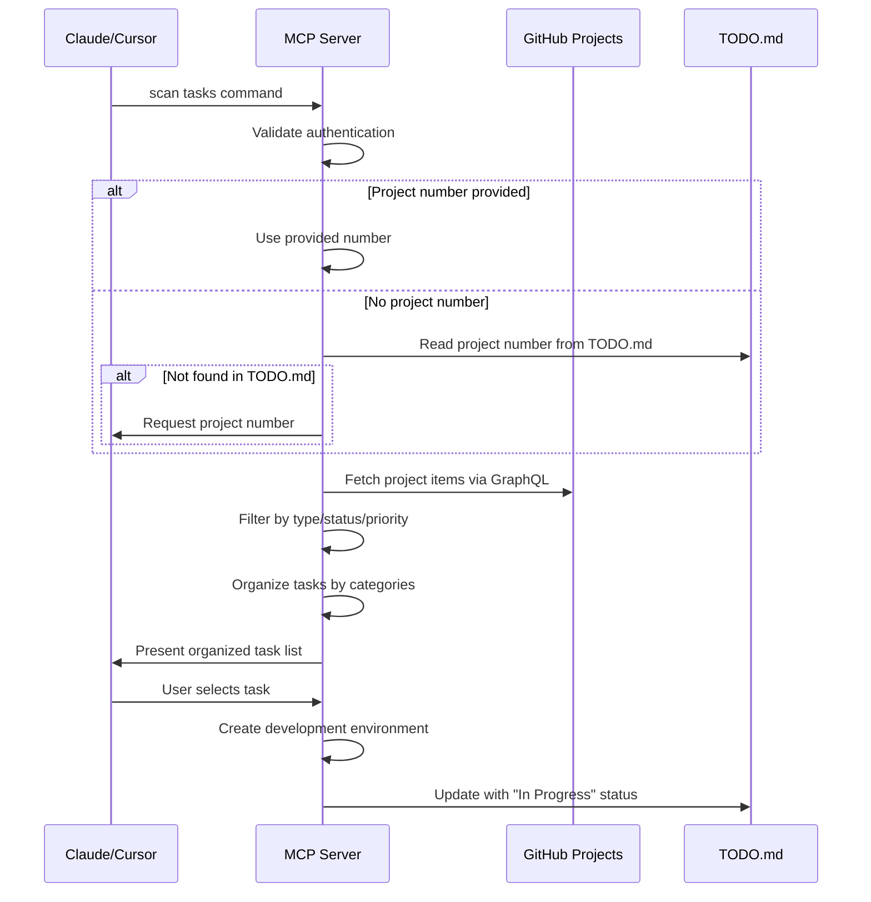
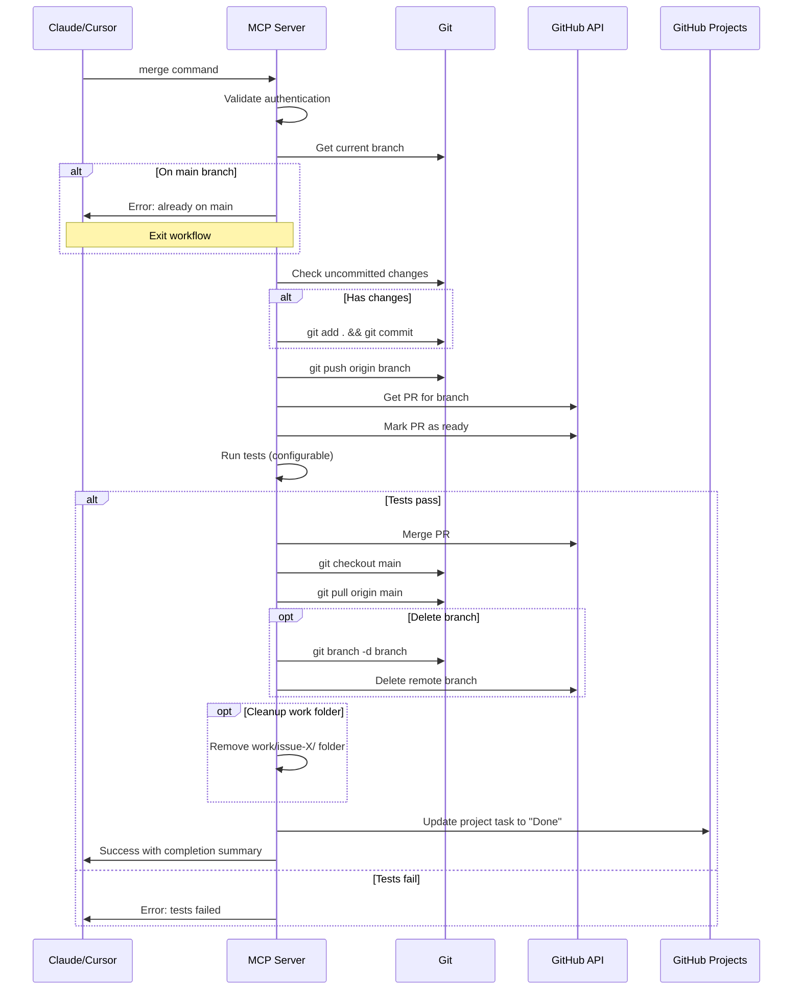
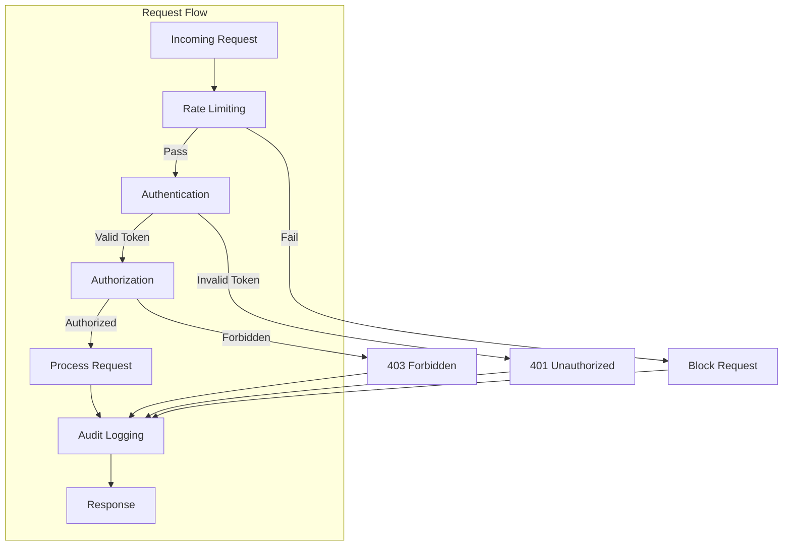
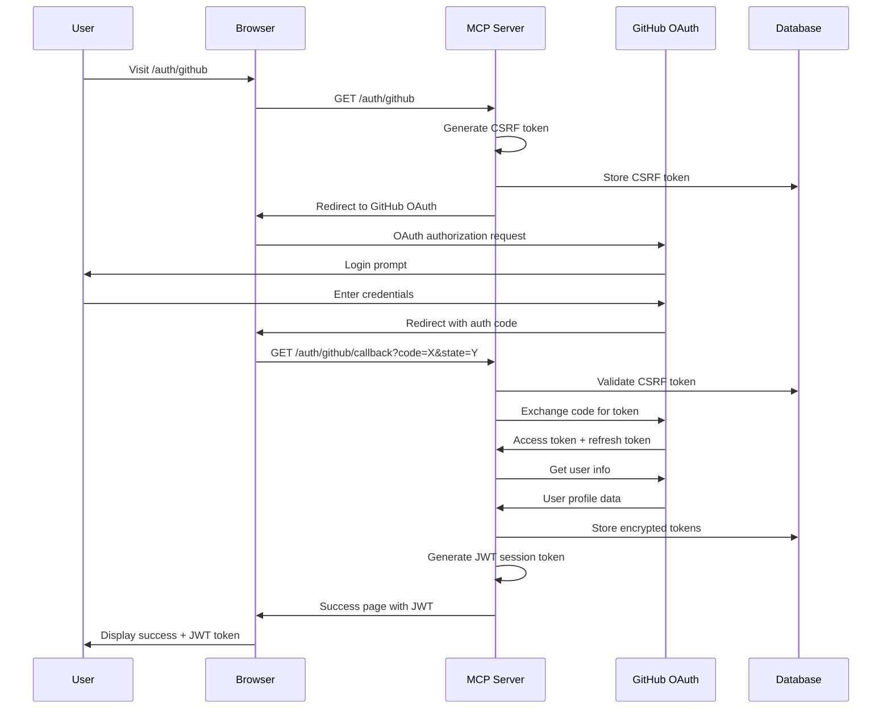
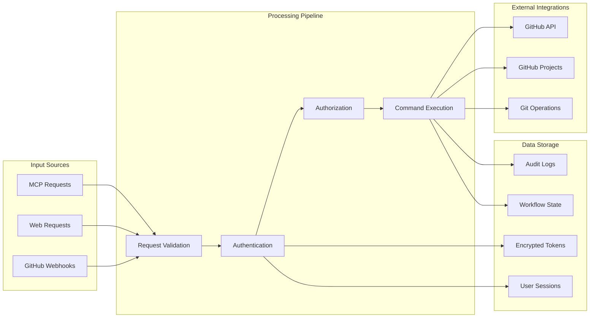
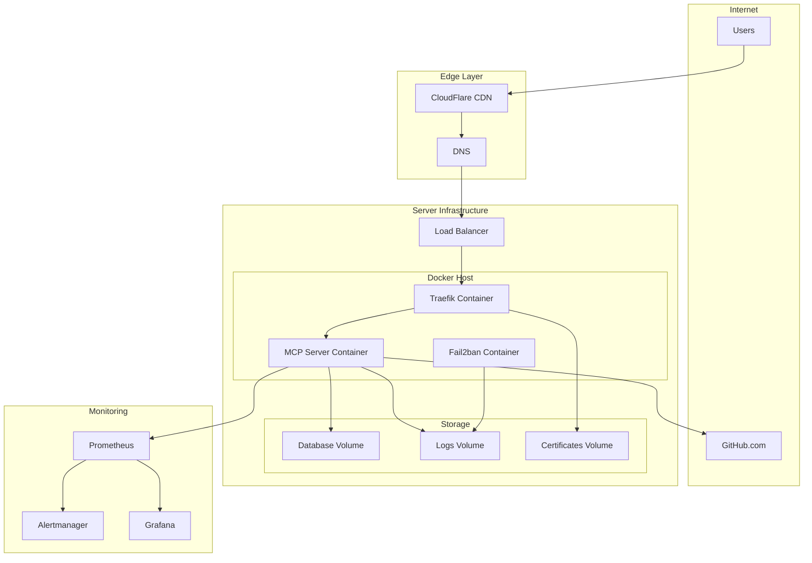

# GitHub MCP Server Workflow Diagram

## Architecture Overview



## Command Flow Diagrams

### 1. Push Command Workflow



### 2. Scan Tasks Command Workflow



### 3. Merge Command Workflow



## Security Flow



## Authentication Flow



## Data Flow Architecture



## Deployment Architecture



## Draw.io XML Export

To import this into draw.io:

1. Copy the XML content below
2. Go to https://app.diagrams.net/
3. File → Import from → Text
4. Paste the XML content

```xml
<!-- This would contain the actual draw.io XML format -->
<!-- For now, use the mermaid diagrams above as reference -->
<!-- Convert using: https://mermaid.live/ → Export → draw.io -->
```

## Usage Instructions

1. **For Development**: Use the mermaid diagrams directly in your documentation
2. **For Presentations**: Export mermaid diagrams to PNG/SVG
3. **For Collaboration**: Import into draw.io for team editing
4. **For Documentation**: Include in README.md files

## Diagram Updates

When updating workflows:

1. Update the mermaid diagrams in this file
2. Export new versions to draw.io if needed
3. Update any related documentation
4. Commit changes to version control